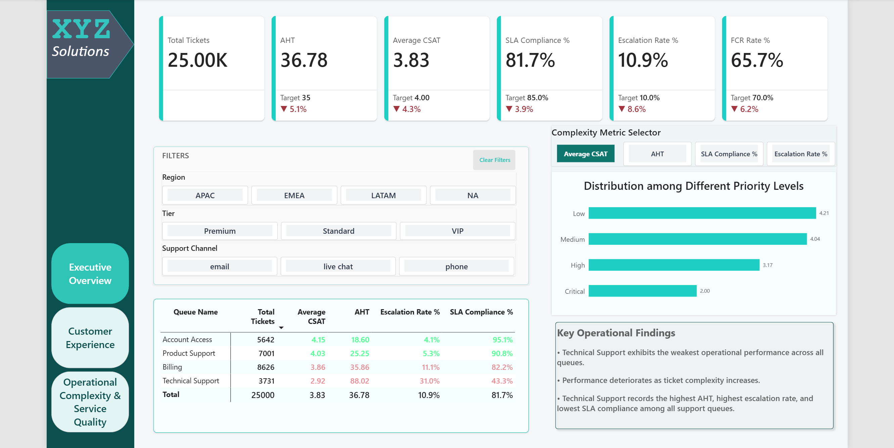
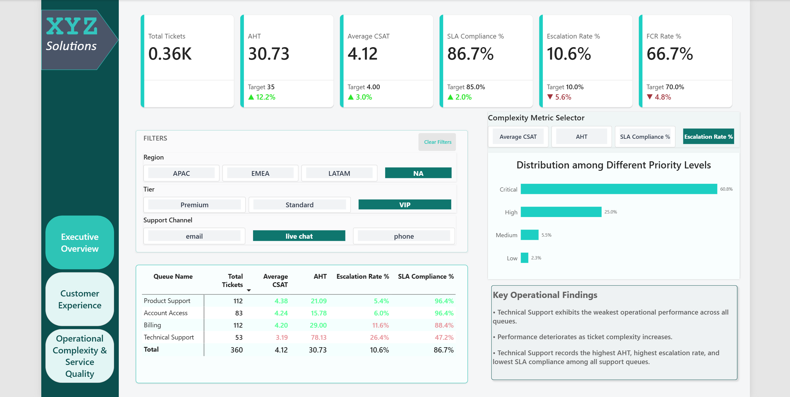
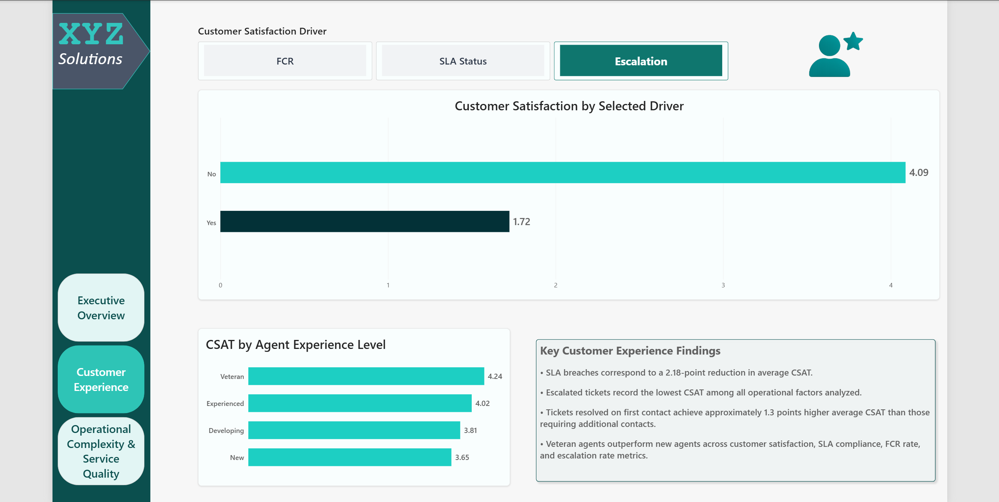
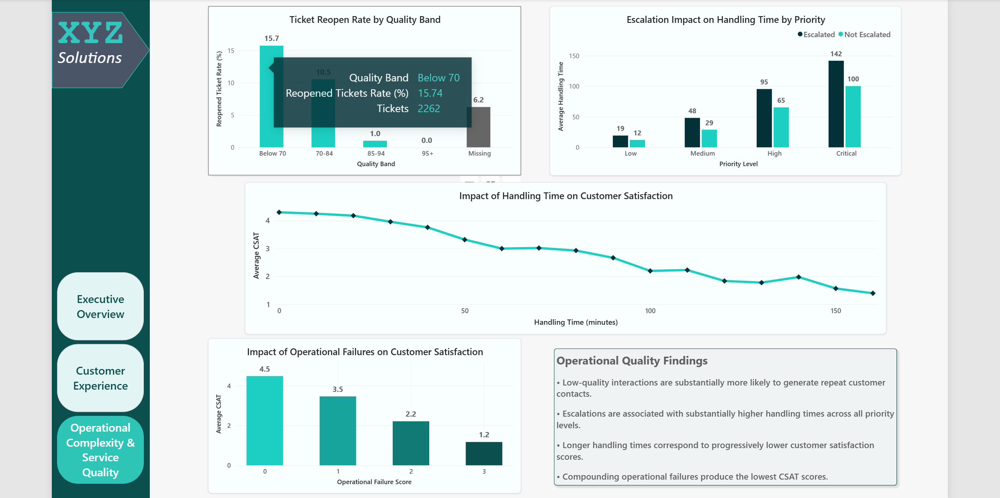

# Customer Support Analytics Project

## Overview

This project analyzes customer support operations to identify the operational factors that influence customer satisfaction, service quality, and support efficiency.

Using PostgreSQL and Power BI, the project follows a complete analytics workflow from data validation and cleaning to exploratory analysis, KPI development, dashboard creation, and business recommendations.

The goal was not only to measure performance metrics but also to understand the underlying drivers behind customer and operational outcomes.

The project emphasizes diagnostic analysis and business storytelling rather than descriptive reporting alone.

**Note:** The Power BI dashboard file (.pbix) is maintained in a private repository. Dashboard screenshots, SQL scripts, sample data, and analytical outputs are provided here for portfolio review purposes.

---

## Business Questions

The analysis was designed to answer questions such as:

* What factors have the greatest impact on customer satisfaction (CSAT)?
* How does First Contact Resolution (FCR) influence customer experience?
* What effect do escalations have on service outcomes?
* Which support queues perform most effectively?
* How does handling time affect customer satisfaction?
* Does agent experience influence operational performance?
* Where are the largest opportunities for service improvement?

---

## Dataset

The project uses a synthetic customer support dataset containing approximately 25,000 support interactions across multiple regions, customer segments, support channels, and issue categories.

The public repository includes a 5,000-row sample dataset for demonstration purposes.

Key metrics include:

* Customer Satisfaction (CSAT)
* First Contact Resolution (FCR)
* Escalation Status
* Average Handling Time (AHT)
* SLA Compliance
* Quality Scores
* Agent Tenure

---

## Project Workflow

### 1. Data Validation & Cleaning

Before analysis, the dataset was reviewed for quality, consistency, and business logic accuracy.

Key activities included:

* Data validation and quality checks
* Identification of data type inconsistencies
* Resolution of numeric conversion and formatting issues
* Standardization of reporting fields
* Creation of cleaned analysis-ready tables

This phase ensured reliable inputs for downstream analysis and reporting.

### 2. SQL Analysis

Using PostgreSQL, the project moved beyond basic reporting to investigate the operational drivers behind customer outcomes.

Analysis included:

* KPI development and performance measurement
* Customer segmentation by region, tier, and support channel
* Queue-level and issue-type performance analysis
* Investigation of relationships between CSAT, FCR, escalations, and handling time
* Agent experience and operational effectiveness analysis
* Identification of performance trends, bottlenecks, and improvement opportunities
* Creation of reporting views to support Power BI dashboard performance and visualization

The analysis focused on distinguishing meaningful operational drivers from simple metric comparisons to support evidence-based recommendations.

### 3. Dashboard Development

Interactive Power BI dashboards were created to communicate findings through:

* Executive KPI Overview
* Customer Satisfaction Analysis
* Queue Performance Analysis
* Operational Effectiveness Insights

Dashboard features include:

* Interactive filtering by Region, Customer Tier, and Support Channel
* Dynamic metric switching using field parameters
* Custom report tooltips for analytical drilldowns
* Cross-filtering across report pages

---

## Key Findings

### Customer Satisfaction Is Closely Linked to Operational Execution

Tickets experiencing multiple operational failures recorded substantially lower satisfaction scores than tickets resolved without SLA breaches, escalations, or First Contact Resolution failures.

### Escalations Have a Significant Negative Impact

Escalated tickets produced substantially lower satisfaction outcomes and required additional handling effort compared to tickets resolved by frontline support.

### Handling Time Is a Stronger Driver Than Support Channel

Analysis suggests that the efficiency of issue resolution has a greater influence on customer experience than the support channel used.

### Ticket Complexity Affects Multiple Performance Metrics

Complex issues were associated with longer handling times, higher escalation rates, increased SLA risk, and lower customer satisfaction.

### Quality Strongly Predicts Reopen Risk

Tickets with the highest quality scores showed virtually no reopen activity, suggesting strong execution quality can significantly reduce repeat workload.

### Agent Experience Supports Better Operational Outcomes

More experienced agents generally demonstrated stronger performance across key service metrics.

---

## Business Recommendations

* Improve First Contact Resolution through targeted training and knowledge management initiatives.
* Reduce avoidable escalations by strengthening frontline support capabilities.
* Allocate additional resources to high-complexity support queues.
* Focus on handling-time optimization while maintaining service quality.
* Continuously monitor operational KPIs to identify emerging performance issues.

---

## Tech Stack

* PostgreSQL (Data Cleaning, Analysis, Reporting Views)
* Power BI (Data Modeling, DAX, Dashboard Development)

---

## Repository Structure

```text
customer-support-analytics
│
├── Data
│   └── customer_support_sample.csv
│
├── SQL
│   ├── 01_data_preparation.sql
│   ├── 02_analysis_queries.sql
│   └── 03_reporting_views.sql
│
├── Dashboard
│   ├── Executive_Overview_Default.png
│   ├── Executive_Overview_Filtered.png
│   ├── Customer_Experience.png
│   └── Operational_Complexity_Service_Quality.png
│
├── Reports
│   └── Findings_and_Recommendations.pdf    # Project findings and business recommendations
│
└── README.md
```

---

## Dashboard Preview

### Executive Overview (Default View)



Provides a high-level summary of support operations, KPI performance, queue-level metrics, and complexity analysis.

### Executive Overview (Filtered View)



Demonstrates dashboard interactivity through Region, Customer Tier, Support Channel, and Metric Selector filtering.

### Customer Experience Analysis



Explores the relationship between customer satisfaction and key operational drivers including FCR, SLA compliance, escalations, and agent experience.

### Operational Complexity & Service Quality



Examines quality scores, reopen rates, handling time impacts, escalation effects, and cumulative operational failures.

---

## Contact

**Kartik**

📧 Email: kartik251020@gmail.com

💼 LinkedIn: https://linkedin.com/in/kartik251020
